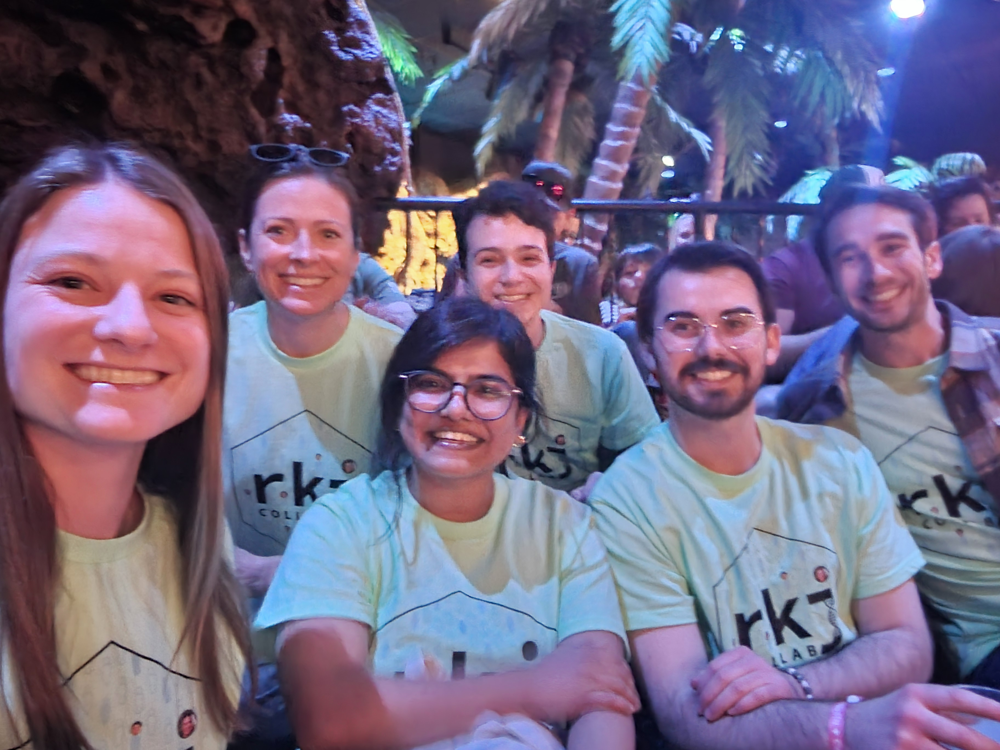

# Welcome to RKJcollab

Our goal is to impact population health by leading high-quality, consequential research at the intersection of epidemiology and precision medicine. 
We specialize in the integrative analyses of multi-omics, genetics/genomics, questionnaire, and/or EHR data to: 
1) provide insight into disease development and progression, 
2) improve secondary prevention through early detection of disease or identification of high-risk groups, and 
3) enable precision prevention. We accomplish our work using open-source software implemented in high-performance and cloud computational spaces, and with a particular focus on autoimmune and allergic diseases. 

---

## Photo Gallery

  
  
  
  
  
  
  
   
  
  
  
  
  
  
  
  
  

