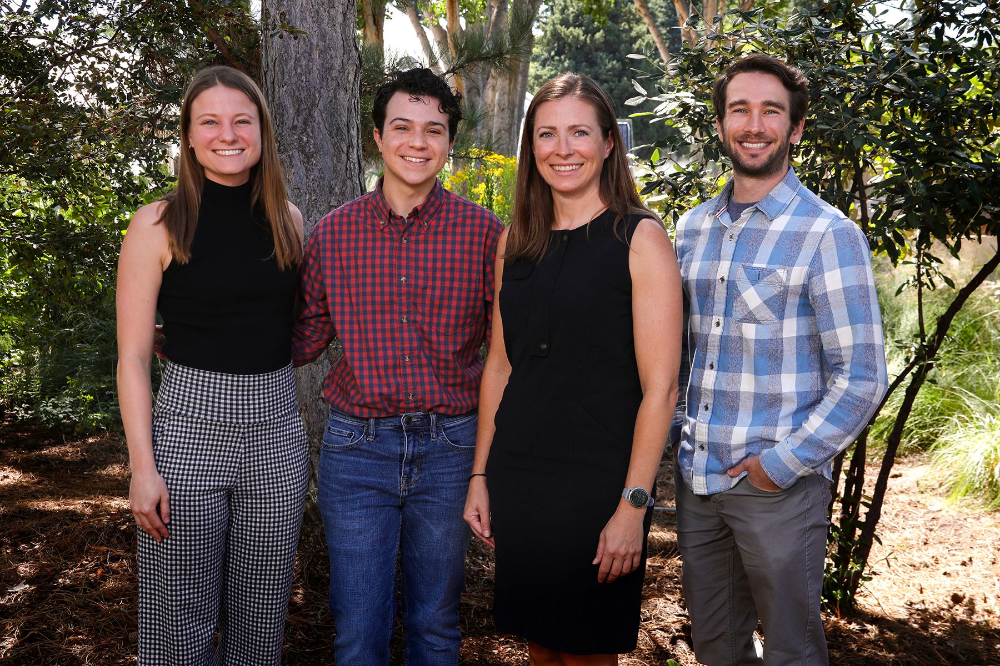

# Welcome to RKJcollab

Welcome to our lab! We are a collaborative research group focused on T1D.

We work at the intersection of science and technology to build tools, publish findings, and train the next generation of researchers.

---

## Photo Gallery

  
  
  
  
  
  
  
  
  
  
  
  
  
  
  
  

